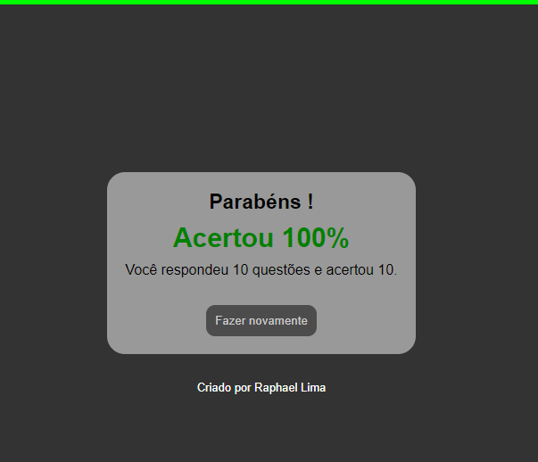

# quiz
Projeto que utiliza JavaScript e simula um jogo de quiz.

## Minha aplicação:

## Sobre a aplicação:

Esse sistema usa o JavaScript para extrair dados de um objeto de um arquivo JSON, para através da 
manipulação dessas informações se montar o layout para o usuário e capturar suas respostas para as comparar com 
as respostas do mesmo arquivo JSON. Ao final do quiz se mostra a porcentagem de acertos.

## Por que essa aplicação?

Esse algoritmo foi ensinado em um workshop da empresa b7web, eu o implementei para fins didáticos e para desenvolvimento 
do meu portfólio pessoal.
